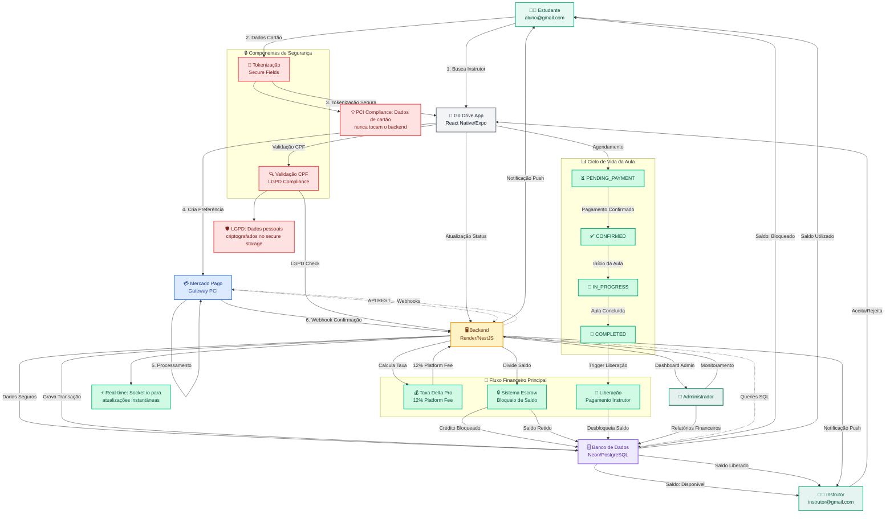

# Diagrama de Fluxo de Dados - Go Drive Platform

## Arquitetura Financeira e Integração

## 📋 Descrição dos Componentes

### 🎭 Atores do Sistema
- **Estudante**: Usuário final que busca aulas e realiza pagamentos
- **Instrutor**: Profissional que oferece aulas de direção
- **Administrador**: Gestor da plataforma (Delta Pro Tecnologia)

### 💳 Fluxo de Pagamento
1. **Tokenização Segura**: Dados do cartão são processados via Secure Fields
2. **Gateway PCI**: Mercado Pago garante conformidade PCI DSS
3. **Webhook**: Confirmação assíncrona do pagamento
4. **Escrow**: Sistema de bloqueio de valores até conclusão do serviço

### 🏦 Lógica Financeira
- **Taxa de Plataforma**: 12% sobre cada transação (receita Delta Pro)
- **Divisão de Saldo**: Bloqueado (aluno) → Retido (instrutor)
- **Liberação**: Após conclusão da aula com status COMPLETED

### 🔒 Segurança e Compliance
- **Validação CPF**: Verificação em tempo real contra receita federal
- **LGPD**: Armazenamento seguro de dados pessoais
- **PCI DSS**: Conformidade com padrões de segurança de cartões

### 📊 Status da Aula
- **PENDING_PAYMENT**: Aguardando confirmação
- **CONFIRMED**: Pagamento aprovado, aula agendada
- **IN_PROGRESS**: Aula em andamento
- **COMPLETED**: Aula concluída, saldo liberado

---

## 🎯 KPIs e Métricas de Negócio

| Métrica | Descrição | Impacto |
|---------|-----------|---------|
| **Taxa de Conversão** | % de agendamentos concluídos | Receita Delta Pro |
| **Ticket Médio** | Valor médio por aula | Otimização de preços |
| **Tempo de Liberação** | Prazo pagamento → instrutor | Satisfação profissional |
| **Churn Rate** | % de instrutores inativos | Retenção de talentos |

---

*Diagrama criado para apresentação à Delta Pro - Janeiro 2026*
